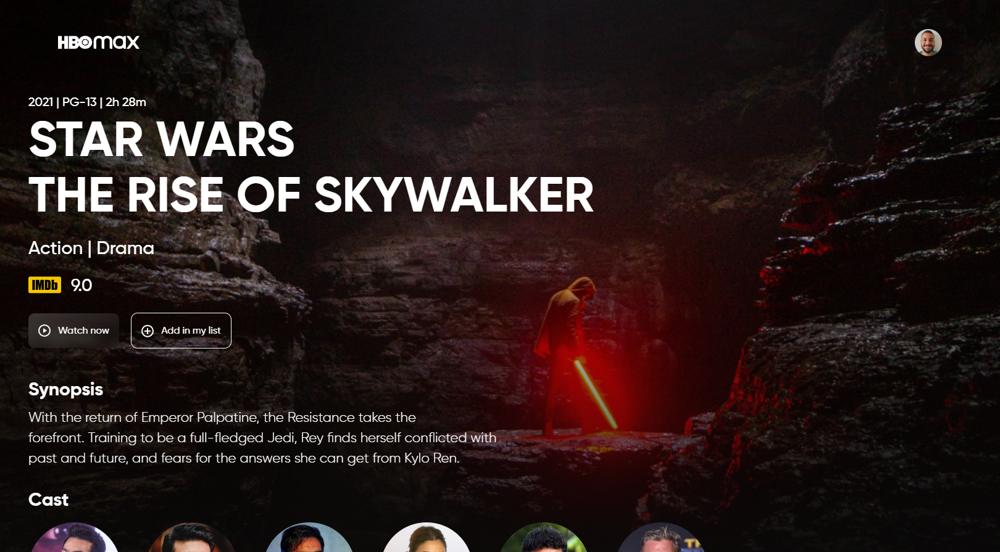
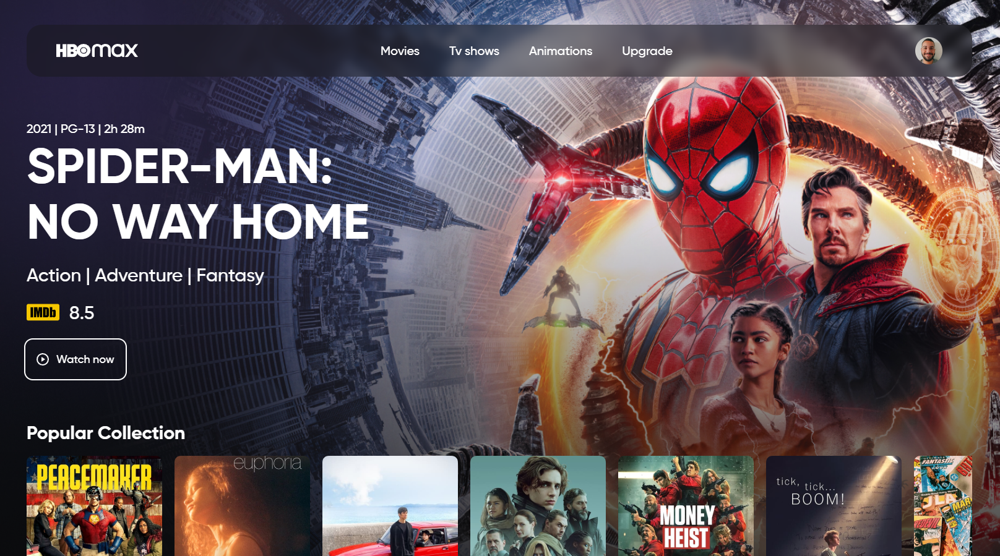

<h1 align="center">
  HBO Max
</h1>

  
   

  <a href="#-tecnologias">Tecnologias</a>&nbsp;&nbsp;&nbsp;|&nbsp;&nbsp;&nbsp;
  <a href="#-projeto">Projeto</a>

## 🚀 Tecnologias

Esse projeto foi desenvolvido com as seguintes tecnologias:

- HTML
- [Tailwind CSS](https://tailwindcss.com/)

## 🚧 Projeto:

Em construção

## 🎨 Inspiração:

Figma: https://www.figma.com/file/2A51gQJCk5V6LxcIh2en0b/HBO-Max-Redesign-Web-App-(Community)
Youtube: https://www.youtube.com/c/birobirobiro
Github: https://github.com/birobirobiro

---

Feito com ♥ by Matheusvgdr